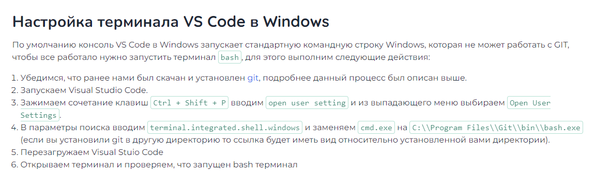
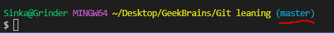

# **Working with Git in Visual Studio Code**
## **Beginning**
### **Why we need versions?**
*Сохранение версий нужно для того, чтобы хранить и возвращаться к любой предидущей версии. Навигировать через версии.
Git сохраняет изначальную версию + отдельно изменения, которые вносились в версии, без необходимости переписывать файлы несколько раз. При обращении к отличной от изначальной версии, Git сам конструирует нужную версию из изначального файла и сохраненных изменений*

### **Before we start**

Необходимо настроить работу git и Visual Studio Code, для этого следуем инструкции:

### **Adding folder for tracking**
File > Open folder

 В работу будет взята именно та папка, что была выбрана. Чтобы переключиться на другую, нужно еще раз открыть другую папку.

 Папка, за который присматривает git, становится **РЕПОЗИТОРИЕМ** - папкой, в которой настроена система контроля версий.

        git version - версия установленного git, проверка правильной установки

        git init - initiate запуск git для выбранной папки БЕЗ ЭТОГО git ОТСЛЕЖИВАТЬ ПАПКУ НЕ БУДЕТ. Подпапки и файлы в них, если их создать, он тоже отслеживает

Убедиться, что git запущен и посмотреть по умолчинаю скрытую папку .Git можно командой

    ls -a  - показать скрытую папку git

*Везде для использования git после него (он какбы команда) нужен пробел.*

*Git может ничего не коммитить, если нет пользоватьеля и емейл. Внимательно посмотрте на сообщения на экране, при первом запуске нужно себя обозначить:*

        git config --global user.name "Your name"
        git config --global user.email "your@email"

Так же нужно убедиться, что вы работаете с **master** веткой версий. Если в конце строки нет приписки **master** и она выглядит иначе:

Необходимо записать себя мастером при помощи этой команды:

    git config --global init.defaultBranch master - инициализировать себя, как мастера

## **Starting versions creation**

Чтобы иметь возможность работать с git, нам нужно перейти в Terminal: **View > Terminal**

Создавать файлы в папке можно как внутри VSC, так и вне него. Создав файл, нужно добавить его в трэкингу git.

    git add ‘.\??????’  - добавить файла для трэкинга. Либо с ковычками, точкой и слэшем, либо пишем начало названия и TAB. надо использовать после изменений

    git add .   - Добавить все файлы с расшинением в трэкинг

    git rm --cached '.\?????' - Убрать файл из трэкинга

*Проверить, добавился ли файл, все ли под контролем можно командой*

    git status

[!IMPORTANT]
Добавляя любые изменения в созданный файл, нужно сохраняться! Например, сочитанием клавиш Ctrl+S

Чтобы создать контрольную точку, нужно:

    Git commit -m “сообщение в ковычках” делает условное сохранение изменений. Фиксирует изменения и сообщает о новых версиях файлов

    git commit -am “Сообщение” Одновременное использование и add и commit с сообщением

[!IMPORTANT]
*После каждого важного элемента нужно делать **git add** и **git commit -m** или **git commit -am***

Чтобы посмотреть какие изменения и шаги были проделаны, мспользуем команды:

    Git log   - рассказывает исторю сохранений (полную, с кодами сохранений)
    Git log --oneline   - пишет только все названия изменений, заданные в “сообщениях”

Если вы сохранили некую версию ваших файлов, внесли какие то изменения в файлы, но не помните какие (кот прошелся по клавиатуре? О_о) или хотите точно выдеть, что вы меняли, то можно мспользовать команду:

    Git diff - показывает разницу между текущими файлами и последней контрольной точкой

*Если строк на экране стало слишком много, и вы уже в них путаетесь, можно очистить рабочую область Terminal через команду **clear***

### **Switching versions**

Чтобы переключиться на одну из более реннесохраненных версий, используем команду

    Git checkout - восстановить/переключиться на  какую либо из сохраненных версий

Чтобы вернуться к основной версии:

    git checkout master   - вернуться к использованию основной ветки

....To be continued

 
 
## **Syntax for Markdown, my notes**

> *Markdown – это облегченный язык разметки, который является инструментом преобразования кода в HTML. Главной особенностью данного языка является максимально простой синтаксис, который служит для упрощения написания и чтения кода разметки, что, в свою очередь, позволяет легко его корректировать.*

Много полезной информации тут [Справочник по Docs Markdown](https://https://docs.microsoft.com/ru-ru/contribute/markdown-reference)

* Заголовки обозначаются символами хэш-тэга "#" Количество символов задает степень заголовка (от меньшего к большему). Поддерживается до 6 уровней
* "=" и/или "-" подчеркивают заголовки 1го и 2го уровней (символов должно быть не менее 3х подряд)
* Для **полужирного шрифта** нужно использовать "**" или "__" в обрамлении выделяемого текста, без отступов.
* Для _курсива_ нужно использовать "*" или "_" в обрамлении выделяемого текста, без отступов.
* Для ***курсивного полужирного шрифта*** нужно использовать "***" или "___" в обрамлении выделяемого текста, без отступов.
* Чтобы получить ~~зачеркнутый~~ текст нужно использовать "~~" в обрамлении выделяемого текста, без отступов.

#### Списки
* Для сознания ненумерованных списков, используем формат "*(пробел)(элемент списка)". Напр. "* Перый элемент"
* Для сознания нумерованных списков, используем формат "(цифра).(пробел)(Элемент списка)" Напр. "1. Первый элемент"

.....To be continued